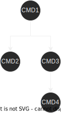
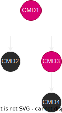

# Dialogue
Create simple, configurable and chainable dialogue cli tool similar to the `psql` or `sqlite3` cli tools in a few lines of code.

### Aims:
- Integrate with the std lib:
    - The cores of the go-dialogue lib are:
    - `io.Reader`
    - `io.Writer`
    - `*flag.FlagSet`
- Simple and configurable.
- Intuituve.
- Minimalist api footprint. (exports only 4 types)

### go get it!
```
go get github.com/Lambels/go-dialogue@latest
```

## Examples:
- Refer to the [examples directory](https://github.com/Lambels/go-dialogue/tree/main/0_examples) for simple examples.
- Take a look at the [gaht](https://github.com/Lambels/gaht) cli, used to interact with chat gpt via the cli. It uses the go-dialogue
tool to build the dialogue like experience and demonstrates a real usecase of the go-dialogue tool.

# A look at some code:
The core type of the lib is the `Dialogue` type:
```go
package main

import (
    "os"
    "log"

    "github.com/Lambels/go-dialogue"
)

func main() {
    d := &dialogue.Dialogue{
        Prefix: "(input-prefix) ",
        R: os.Stdin,
        W: os.Stdout,
        HelpCmd: "help", // will generate the help command for us, it will be accesible under the "help" keyword.
   }

   log.Fatal(d.Open())
}
```
The code is almost done, but this code wont compile. You need to add commands to your dialogue or it wont run:
```go
package main

import (
    // ...
    "flag"
)

func main() {
    // ...

    fs := flag.NewFlagSet("echo", flag.ContinueOnError)
    // n will be set to the default value by the go-dialogue tool after each itteration of the 
    // repeat command by default, no need to reset the value yourself.
    n := fs.Int("n", 1, "sets the number of repetitions of the output")

    repeat := func(_ *dialogue.CallChain, args []string) error {
        // we will take a look at CallChain later, it is used to chain commands.

        for i := 0; i < *n; i++ {
            _, err := fmt.Fprintln(d.W, args...)
            if err != nil {
                return err
            }
        }

        return nil
    }

    d.RegisterCommands(
        &dialogue.Command{
            Name: "echo",
            Structure: "echo [-n repeat] <args>",
            HelpShort: "echo will repeat the args -n times",
            HelpLong: "echo takes in the provided arguments and writes them back -n times (defaults to 1) to the writer",
            FlagSet: fs,
            Exec: repeat,
        },
    )

// ...
}
```
Now your code will compile, lets `go run` it.
```
> go run main.go
> (input-prefix) echo hello world
> hello world
> (input-prefix) echo -n 5 bye world
> bye world
  bye world
  bye world
  bye world
  bye world
> (input-prefix) help
> echo [-n repeat] <args> echo will repeat the args -n times 
  help [-n <command-name>]
> (input-prefix) help -n echo
> echo [-n repeat] <args>

  echo takes in the provided arguments and writes them back -n times (defaults to 1) to the writer

  FLAGS 
  -n=1  sets the number of repetitions of the output
```
This is it, youve built a dialogue command tool, for more advanced topics such as chaining and exiting the dialogue continue reading.
If you want to run this code yourself run the [echo](https://github.com/Lambels/go-dialogue/tree/main/0_examples/echo) example.

## Exiting/Closing the dialogue:
We are going to continue building on the [echo](https://github.com/Lambels/go-dialogue/tree/main/0_examples/echo) example. Now we
are going to add gracefull shutdowns to our dialogue.

Similarly to the `*http.Server` type the `*dialogue.Dialogue` type supports gracefull shutdowns via the `.Shutdown(context.Context)`
method. But first lets take a look at how to close the dialogue abruptly.

```go
package main

import (
    // ...
    "time"
)

func main() {
    // ... (already have a dialogue set up under variable d)
    
    go func() {
        time.Sleep(5 * time.Second)

        d.Close()
    }()

    log.Fatal(d.Open())
}
```
The dialogue will now start as normal but after 5 seconds the base context will be cancelled, this means that any read call waiting
for user input will stop blocking and `d.Open()` will return, this also means that any `command.Exec()` call will also get a signal
in the form of a context cancel to exit and `d.Open()` will similarly return.

You may now have 2 questions, how do I access the base context from the Exec call and how do you cancel a read.
1. Lets take a look at the signature of an Exec function handler:
```go
func execHandler(cc *dialogue.CallChain, args []string) error {
    // recognize the CallChain? to get the underlaying context do:
    currentCommand := cc.GetCurrent()
    // GetCurrent gets the current command running.
    ctx := currentCommand.Context()
    // ctx is the underlaying context of the command which should be used for cancelation.
}
```
2. How do you cancel a read opperation?

Simply put, you dont. The `io.Reader` interface doesnt provide any option to cancel reads, but what you can do is wrap the read
call with a context cancellation, this is explained more in depth in this [article](https://benjamincongdon.me/blog/2020/04/23/Cancelable-Reads-in-Go/).

To see the dialogue implementation of such reads check out the [preamptive reader](https://github.com/Lambels/go-dialogue/blob/main/preamptive_reader.go).

### Gracefull shutdowns:
As I said previously, the dialogue type supports gracefull shutdowns via the `Shutdown(context.Context)` command.

Lets implement a gracefull shutdown which runs when `<Ctrl-C>` signal is recieved:
```go
package main

import (
    // ...
    "os"
    "os/signal"
    "context"
    "time"
)

func main() {
    // ... (already have a dialogue set up under variable d)
    
    // catch the <Ctrl-C> signal.
    c := make(chan os.Signal, 1)
    signal.Notify(c, os.Interrupt)

    // code similar/identic to http server gracefull shutdown:
    go func() {
        <-c
        log.Println("gracefully shutting down dialogue in 5 seconds...")

        ctx, cancel := context.WithTimeout(context.Background, 5 * time.Second)
        defer cancel()

        d.Shutdown(ctx)
    }()

    log.Fatal(d.Open())
```
The behaviour of the `Shutdown()` method is the following:
1. It waits for at most the current transaction to finish then exits.
2. If the context gets cancelled before the current transaction exits, the dialogue exits before the current transaction completes.

## Chaining commands (CallChain):
A core functionality of the go-dialogue tool is the capability of chaining commands.
Similarly to many other go cli building packages, you can build a command tree, in go-dialogue you do this in the following way:
```go
cmd1 := &dialogue.Command{
    Name: "cmd1",
}
cmd2 := &dialogue.Command{
    Name: "cmd2",
}
cmd3 := &dialogue.Command{
    Name: "cmd3",
}
cmd4 := &dialogue.Command{
    Name: "cmd2",
}

cmd1.Subcommands = []*dialogue.Command{
    cmd2,
    cmd3,
}

cmd3.SubCommands = []*dialogue.Command{
    cmd4,
}
```
This is how our command tree currently looks like:



Now lets register some of the commands to make them accessible via the dialogue cli.
```go
d.RegisterCommands(
    cmd1,
    cmd3,
)
```
Now this is how our tree will look like:



I have highlighted in hot pink the commands which are directly accessible, all of the 4 commands are accessible but cmd1 and cmd3
are directly accessible as root commands, cmd2 and cmd4 are only accessible via chaining. Lets take a look at a few commands:

```
> cmd1 --cmd1_flag foo arg1 arg2 cmd2 --cmd2_flag bar arg1 arg2
```
Now the command path / `*dialogue.CallChain` will look like this:
`cmd1 -> cmd2`.

Lets look at another example:
```
> cmd1 arg cmd3 --flag foo cmd4 arg1 arg2
```
The CallChain will look like this:
`cmd1 -> cmd3 -> cmd4`.

Now lets look at some code examples:

You will notice that programatically the call chains are stored inversly and called inversly.
`cmd1 -> cmd3 -> cmd4` will result in `cmd4 -> cmd3 -> cmd1` to give a sense of building towars the root command.
```go
// Current command we are parsing: cmd1 arg cmd3 cmd4 arg1 arg2
// The call chain will look like: cmd4 -> cmd3 -> cmd1

type valCtxKey struct{}

func execHandlerCmd4(cc *dialogue.CallChain, args []string) error {
    // we know that there will always be a command attached to the call chain of cmd4 since it is only exposed as a chained
    // command and cant be accessed as a root command. (cmd4 isnt hot pink in the graph above).
    
    // just log the provided args and call the next command in chain (cmd3).
    log.Println(args) // [arg1 arg2].

    // this call advances the call chain to the next command in the chain and executes the command. It sets the context 
    // of the next command to its context (which is the dialogues base context).
    return cc.AdvanceExec(1, cc.GetCurrent().Context())
}

func execHandlerCmd3(cc *dialogue.CallChain, args []string) error {
    // if you look back at the tree, you will see that this command is hot pinc / a root command. We need to check if cmd3
    // was called as a root command or as part of a longer chain.
    nextCmd := cc.Next(nil)

    if nextCmd == nil { // we are at the root command.
        log.Println(args) // just log the args.
        return nil
    }

    // we are just part of a chain, add a value to the context.
    ctx := cc.GetCurrent().Context()

    ctx = context.WithValue(ctx, valCtxKey{}, "value_from_cmd3")
    return cc.AdvanceExec(1, ctx)
}

func execHandlerCmd1(cc *dialogue.CallChain, args []string) error {
    // we know that cmd1 being the root command cant advance the call chain, you can check this programatically via the Next() method.
    nextCmd := cc.Next(nil)
    // nextCmd will always be nil.
    log.Println(nextCmd) // nil.
    
    ctx := cc.GetCurrent().Context()
    log.Println(ctx.Value(valCtxKey{})) // value_from_cmd3.
    log.Println(args) // [arg].
    return nil
}
```
